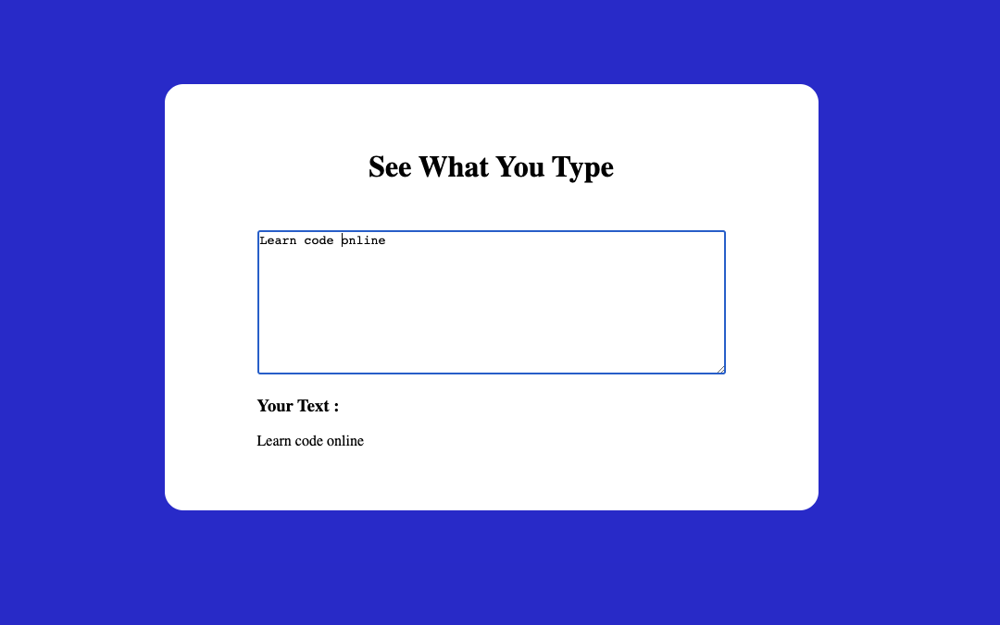

# See what you type using JavaScript

Application displays characters what you just type in text area.

## App Screenshot

[Live Demo 🔗](https://parveshahamed-see-what-you-type.netlify.app/)

## Tools I've used

 

 

 

## Lessons Learned

By building this assignment I've learned how to work with oninput attribute and to manipualate with DOM elements.

## 🚀 About Me

 Student graduating BSc Information Technology, Aspiring young Fullstack Developer🧑‍💻.
